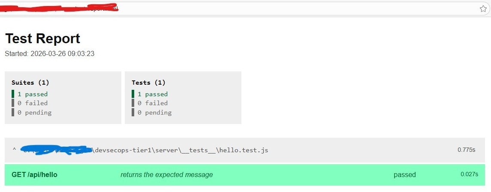

# ENGINEERING IS ABOUT SUSTAINABLE DEVELOPMENT- SCIENCE AND TECHNOLOGY THAT HARMONISES BODY, MIND AND SOUL  - ‘TEMPLATE FOR ENTRY INTO DEVSECOPS WITH TEST DRIVEN DEVELOPMENT’ 
==============================

## 1.0 SUMMARY

&nbsp;&nbsp;&nbsp;&nbsp;Good software development practice involves automation and focused efforts, something that can be sewn around a ‘common/shared understanding’, an understanding which a team can trust and take pride in. The mana and clarity of this understanding can then make the paradigm “there is no ‘I’ in a team” practical. Yes, nowadays AI has a lot of promise, however common sense is that it is a means to an end. Software Development Utopia, still remains in following 'Good Software engineering practice' via:

- a balanced DevSecOps pipeline, according to time, place and circumstances (see Annex A for how the latter principle applies conceptually)

&nbsp;&nbsp;&nbsp;&nbsp;It facilitates code that is maintainable and reliable, even in a cross functional ‘team of teams’ context, where anyone can be asked to pick it up and support it. To this end, this post demonstrates a ‘Proof of Concept’/framework/template, a simple REACT front end client app consuming a node.js server backend microservice, setup with continuous integration using a pipeline in Github Actions, that integrates with Azure Cloud at runtime to retrieve secrets from Key vault. This is a good starting point for a project, so it starts out with the correct building blocks. 

## 2.0 CHANGE LOG

| Version  | Date          | Author   | Description                                                                                                  |
|----------|---------------|----------|--------------------------------------------------------------------------------------------------------------|
| 1.0      | 26 March 2026 | Sarna, J.| Initial Draft and Release to Production.                                                                     |
| 1.1      | 28 March 2026 | Sarna, J.| Added Section 11.0 Disclaimer, and a few minor updates.                                                      |
| 1.2      | 05 April 2026 | Sarna, J.| Added Section 12.0 Annex A.                                                                                  |
| 2.0      | 05 April 2026 | Sarna, J.| Final updates to format, content and references to improve accuracy e.g. BBC's 'AI Decoded' episode addition.|                 
| 2.1      | 09 April 2026 | Sarna, J.| Added reference to IEEE Code of Ethics, to explain family inspiration. Also added reference to 'The Republic' in Annex A to explain immense impact of positivity in history.   
                          
## 3.0 TABLE OF CONTENTS

- [1.0 SUMMARY](#10-summary)
- [2.0 CHANGE LOG](#20-change-log)
- [3.0 TABLE OF CONTENTS](#30-table-of-contents)
- [5.0 MOTIVATION](#50-motivation)
- [6.0 FUNDAMENTALS OF DEVSECOPS](#60-fundamentals-of-devsecops)
- [7.0 CONCLUSION](#70-conclusion)
- [8.0 ACKNOWLEDGEMENTS](#80-acknowledgements)
- [9.0 INSPIRATION](#90-inspiration)
- [10.0 ANNEX A](#100-annex-a)
- [11.0 REFERENCES](#110-references)
- [12.0 DISCLAIMER](#120-disclaimer)

## 4.0 INTRODUCTION
&nbsp;&nbsp;&nbsp;&nbsp;When I introduce myself as a Software Engineer, surprised often people ask, how is programming/coding an engineering field? Is engineering not about building bridges and skyscrapers?

&nbsp;&nbsp;&nbsp;&nbsp;My answer is yes, it is. Today, tell me what does not use software. Software when made under certain guidelines/discipline comes under the banner of software engineering. Two such disciplines are:

- Devsecops, and
- Test driven development (TDD).
 
&nbsp;&nbsp;&nbsp;&nbsp;Devsecops is means to develop code, which enables rapid deployment to production as it in theory has the capability to reduce the time for quality control via automating it. In the past software developers always did have unit tests in their code for basic health checks. However, Devsecops takes this concept to the next level as it attempts to automate frontline testing too e.g. end to end system tests, the domain of the IT Quality Assurance profession.

&nbsp;&nbsp;&nbsp;&nbsp;Further, in the construct of Devsecops, Test Driven Development (TDD) is the idea that all code is written to satisfy tests. So, the development process would involve identifying stories, which would distil into requirements, which in turn would lead to automated tests and then code would be written to satisfy those tests:

- Stories > requirements > automated tests > code written to satisfy tests

&nbsp;&nbsp;&nbsp;&nbsp;If changes in the form of new design vectors or business requirements appear, rapid re-factoring would realign the development effort. I first came across TDD at my Software Engineering degree at the University of Auckland in the early 2000s, as part of learning Xtreme programming, which can be slated as a somewhat precursor to DevSecOps.    

&nbsp;&nbsp;&nbsp;&nbsp;Following such 'Best practices' builds code that is holistic for the people who create it, the people who consume it and the people who support it, as the underlying paradigms and principles follow 'high maturity' constructs, building 'love and care' vectors like maintainability and reliability into the product - good for the body, mind and soul (His Holiness Radhanath Swami, 2025, December, 15, 2:00-3:00).

## 5.0 MOTIVATION
  
&nbsp;&nbsp;&nbsp;&nbsp; Mr. Paul Joseph Goebbels, the propaganda minister of NAZI Germany during WWII famously said along the lines of that if a lie is repeated often enough, the standard human psyche starts accepting it as ‘true’. In modern lingo, we call it disinformation. In the era of chaos caused by over hype of capabilities of Artificial Intelligence (AI), people struggle to see that AI is the new wild west frontier (Bogan, 2026, Pg. 55), i.e. needs to be treated with caution, and yet it is important to discern that our future is in the correct use of AI (His Holiness Radhanath Swami, 2025, December, 15, 5:00-7:00). The overwhelming propaganda for AI today is coming from adverts being pumped at us in Social Media by those with the clout and intent to keep us confused. This kind of disinformation is also the theme of the recent winner of the "Best Animated Feature" at Academy awards - "K-Pop Demon Hunters" (Rashid, 2026, March, 16). To keep my narrative positive, in the Spirit of Non-violence, I see it as a test from Providence, which only the discerning will pass (BBC News, 2026, April, 4).
  
&nbsp;&nbsp;&nbsp;&nbsp;If AI is seen for what it is, a tool, then:

- the lessons about sustainable software engineering practice from my university golden days remain valid today.  

&nbsp;&nbsp;&nbsp;&nbsp;I seek to refocus the world to what is important – the fundamentals of Software Engineering practice. Hence this blog post is about fundamentals of DevSecOps practice, as I experienced it.

## 6.0 FUNDAMENTALS OF DEVSECOPS
  
&nbsp;&nbsp;&nbsp;&nbsp;I demonstrate this via two GitHub ACTIONS projects. The first one incorporates a simple node.js micro server and a simple REACT client consuming that microservice’s API endpoints. What makes it special is that all the code was produced in the spirit of Test Driven Development. Further, as per CONTINOUS INTEGRATION (CI) paradigm of DEVSECOPS, any updates to the code trigger a CI pipeline that runs those tests, providing instant feedback about:

- Is code quality up to the mark for deployment to production.

&nbsp;&nbsp;&nbsp;&nbsp;Lastly, in 2026, any code outside the cloud automatically gets the label of legacy, and hence the dev branch of the repository integrates this DEVSECOPS model code to Azure Cloud. The server has an endpoint that requires an API KEY to access it. The code hence:

- retrieves APIKEY at runtime from Key vault in Azure Cloud as part of continuous integration, and uses it to run tests

&nbsp;&nbsp;&nbsp;&nbsp;Please see GITHUB repo for details:

- https://github.com/BoundlessLove/devsecops-tier1/tree/dev

&nbsp;&nbsp;&nbsp;&nbsp;Further, DEVSECOPS also includes the CONTINOUS DEPLOYMENT (CD) Paradigm, i.e. any updates to the code, are at once tested under CI and then deployed to STAGING for User Acceptance Testing. CONTINUOUS SECURITY and CONTINUOUS OPERATIONS are the other aspects of DEVSECOPS. Please find a practical demonstration of these three operate via a node.js server on Azure Kubernetes cloud in a GITHUB CICD pipeline: 

- https://github.com/BoundlessLove/devsecops-tier3/

## 7.0 CONCLUSION

&nbsp;&nbsp;&nbsp;&nbsp;This post presents the concept and code behind the motivation that a software engineering project starting with its fundamentals aligned to best software engineering practices is more likely to succeed in the long run. Justification is found in idiom:

- "A stitch in time, saves nine"- Thomas Fuller (1732 from book 'Gnomologia: Adagies and Proverbs'),

 ## 8.0 ACKNOWLEDGEMENTS
  
&nbsp;&nbsp;&nbsp;&nbsp;I am from the IT Quality Assurance Engineering profession, a discipline I have been a part of since 2007. In 2021, a new QA standard was introduced IEEE 29119 Part 6- Software testing on Agile Projects. It made the unusual step of providing a guideline that quality assurance professionals will no longer create bugs/defects – refer to section 4.2.26 Informal Defect Management (ISO/IEC/IEEE, 2021, Pg.12-13). This shook my professional beliefs and practices to the core and I am still recovering. The impact is multifaceted and profound. There are many layers of truth in this standard, however, people tend to take shortcuts and in the chaos of conversations, often the voice of reason gets drowned out. To me the standard emphasises the urgent need to apply test automation in QA practice, but it is not a license to do away with essential documentation, where the ‘essential’ is defined in a Test Policy (formalised by QA subject matter expert/s only)- refer to section ‘4.2.17 Eliminate Waste’ of standard (ISO/IEC/IEEE, 2021, Pg. 10). 

&nbsp;&nbsp;&nbsp;&nbsp;Getting bogged down with negotiating an ever losing battle on this front, instead I redirected my ‘chi’, in the spirit of transforming my struggles into strength. I began on a journey of rediscovering the joy of being a programmer by upskilling and investing in what forged me in this career all those years ago at university- Software Engineering (His Holiness Radhanath Swami, 2019, Aug, 9). 

&nbsp;&nbsp;&nbsp;&nbsp;Lastly, I thank my family who have put up with my Trademe Sam Morgan type ‘stay at home’ vagrancy, with infinite patience (O'Donnell, 2010). 

## 9.0 INSPIRATION
&nbsp;&nbsp;&nbsp;&nbsp;My late paternal grand mother/aunt Sanatana Dharma Nun Her Holiness Kumari Raj Sarna, who asked us to live by higher principles - Engineering Ethics (IEEE, 2026) and Ancestral guidance from scriptures such as the Holy MAHĀBHĀRATA VANA PARVA CHAPTER 313 VERSE 128  (Ram/राम , 2024, Pg. 993), source of her OATH book. 

Jay Sarna, BE (Software), CEH

a. https://www.blog.systematicdefence.tech

b. https://testdrivendevelopment.azurewebsites.net/cicd.html

## 10.0 ANNEX A
  
&nbsp;&nbsp;&nbsp;&nbsp;For example in history, it is often seen that there are roughly two camps- "the do gooders" and the "the do no-gooders" amongst any group of people. However, as it happens, fate sometimes makes righteous souls to be born in "do no-gooders camp" and vice versa. For example, in a prevailing time of violent resistance to colonisation across the world in early 1900s, Mahatma Gandhi (Father of Modern India) advocated non-violent resistance to oppose unjust use of power by UK. He firmly believed "An eye for an eye will leave the whole world blind", redirecting the "chi" of his "Indian National Congress" peers to peaceful co-existence, in the name of "One God". Hence, modern India became a model of non-violent resistance, sparking later the character of legends like Dr. Martin Luther King, Sir Nelson Mandela and Former US President Obama (Mendez II, 2025, Jul, 19) (Obama, 2009, April, 06). Similarly, the beacon of Non-violence in New Zealand is 'Te Whaea o te Motu'/'Mother of the Nation'-  Wahine Toa Dame Whina Cooper who operated in the spirit of Te Tiriti o Waitangi when dealing with unjust use of power in a colonialism context (Hemi-Morehouse & Hill, 2025, August, 12) (Robertson & Jones, 2022). They all brought relative calmness and somewhat correct focus in a time of great upheaval. 

&nbsp;&nbsp;&nbsp;&nbsp;Truth is that humanity cannot survive in negativity and eventually caves in as all progress eventually needs positivity to embed itself. There are multiple examples of this in history, such as: 

### a. GOLDEN PERIOD OF HELLENESTIC AGE: 

&nbsp;&nbsp;&nbsp;&nbsp;For example, the Greek Philosopher Plato in his 360 B.C. work 'The Republic' expressed when talking about Greeks, "Slavery as being worse than death" (BOOK III) and generally argued it as being unjust (Book V 469b–471c), advising diplomacy (what he called discord) to replace violence in his ideal Greek state. This was at a time when the practice of slavery was commonplace amongst Greeks and something that did not effectively begin to halt until Dr. Martin Luther King and his "Non-Violent" movement convinced Late US President Lyndon B. Johnson to sign the Civil Rights Act of 1964. Such shots at positivity even in 'fallen' ancient history gave the Greek nation a moral edge to unite and further motivated them to try to spread it across the known world (at a lesser degree), making them masters of their era (Plato, 360 B.C.E).

### b. NEGATIVITY DRIVEN DARK AGES:  

&nbsp;&nbsp;&nbsp;&nbsp;Looking at Medieval history, my peaceful 'Sanatana Dharma' native ancestors of the North-Western region of the Indian Sub-continent were displaced in waves by the 'violent ideology'/jihad fueled by disinformation and quest for booty, from an extremist brand of a faith for over millennia. My ancestors refused to be intimidated or accept/assimilate the disinformation forced on us by the violent despite the near complete annihilation of the native culture (via obliteration of the supportive ecosystem). It was the ancient books that kept the knowledge safe. With the books, the spirit of 'Non-Violence' resistance could be re-awakened via strong faith in Providence, and my ancestors focused on self-help and education in an ever-worsening environment. This is a very hard thing, that is easier said than done, requiring an almost obsessive discipline on the face of it, to weather with zero/negative support (INSIDE GOVERNMENT,  2026, April, 09). 

&nbsp;&nbsp;&nbsp;&nbsp;As it was going to happen, with time, the same conquering parties disavowed the animalism in their very beliefs that enabled them to intimidate and do 'ISIL and Al Qaeda' level unimaginable grotesque violence on the natives (Okoth-Obbo, 2020, August, 2), when they wanted cooperation from the conquered and forcibly converted in order for progress (see Munajat-Nama / 'Intimate Conversations' (Ansari, 1978)), leading to a trail of excellence (vedictreasure.official, 2025, April, 12).   

### c. CONCLUSION: 

&nbsp;&nbsp;&nbsp;&nbsp;Hence, it is adherence to righteous knowledge and character, which is the 100% guarantee to stay on the correct path, based on "time, place and circumstances".

## 11.0 REFERENCES (Note: Some urls are incomplete)
1. Bogan, C.(2026).Very Brief History of Synthetic Media. Behind the AI MASK- Protecting your business from deepfakes. Published by John Wiley & Sons, Inc., Hoboken, New Jersey.
   
3. His Holiness Radhanath Swami.(2025, Dec, 15).YouTube- Technology for the Soul | Radhanath Swami | Massachusetts Institute of Technology. https://www.youtube.com/watch?v=UiL8zUp54ow&list=LL.... Last  Accessed 26 March 2026.
   
5. His Holiness Radhanath Swami.(2019, Aug, 9). YouTube- Transforming Our Struggles Into Strength | His Holiness Radhanath Swami. https://www.youtube.com/watch?v=abmsniEmfh0. Last  Accessed 26 March 2026.
   
7. International Organization for Standardization (ISO)/ International Electrotechnical Commission (IEC)/ Institute of Electrical and Electrical Engineers (IEEE). (2021). ISO/IEC/IEEE 29119 6:2021(E): Software and systems engineering — Software testing — Part 6:  (all parts) in agile life cycles. Published by ISO.
   
9. O'Donnell, M. (2010). Trade Me: The inside story. Phantom House Books
    
11. Mendez II, M.(2025, Jul, 19).  Yahoo! news- out- Barack Obama explains why he thinks all men need queer people in their lives. https://www.yahoo.com/.../barack-obama-explains-why.... Last Accessed 05 April 2026.
12. 
13. Obama, B. (2009, April, 06). United States Government- The White House President Barrack Obama- Remarks by the President at Cairo University, 6-04-09- REMARKS BY THE PRESIDENT ON A NEW BEGINNING. https://obamawhitehouse.archives.gov/.../remarks.... Last Accessed 05 April 2026.
    
15. Robertson, J. N., Jones, P. W. (2022). New Zealand Film Commission | Te Tumu Whakaata Taonga -Whina. https://www.nzfilm.co.nz/films/whina. Last accessed 02 February 2026.
    
17. Hemi-Morehouse, S., Hill, D.(2025, August, 12). Mother of the Nation: Whina Cooper- Whina Cooper and the Long Walk for Justice. Published by Penguin Books.
    
19. Hemi-Morehouse, S., Hill, D.(2025, August, 12). Te Whaea o te Motu- Whina Cooper me te Hīkoi roa mō te Manatika. Translated into te reo Māori by Morrison, S. Published by Penguin Books.
    
11.0 BBC News.(2026, April, 4). AI Decoded - Episode 10: Are humans useless in the AI workspace?. https://www.bbc.co.uk/programmes/m002bc0j

12.0 Rashid, R.(2026, March, 16). The Guardian- Oscars 2026- South Korea celebrates ‘miracle’ Oscar wins for KPop Demon Hunters. https://www.theguardian.com/.../kpop-demon-hunters-oscar...

13.0 Ansari, A. (1978). Kwaja Abdullah Ansari: The Invocations (Munajat) (W. M. Thackston, Trans.). Paulist Press. (Original work published c. 1088).

14.0 Okoth-Obbo, V. (2020, August, 2). United Nations Development Programme (UNDP)- Home > Iraq > Stories > Six Years After Sinjar Massacre, Support and Services are Vital for Returning Yazidis. https://www.undp.org/.../six-years-after-sinjar-massacre.... Last Accessed: 05 April 2026

15.0 IEEE- Advancing Technology for Humanity. (2026). IEEE Code of Ethics. https://www.ieee.org/about/corporate/governance/p7-8. Last accessed 02 February 2026
16.0  [Hindi Mahabharata] साहित्याचार्य पंडित रामनारायण दत्त शास्त्री पांडेय 'राम'.(2024). अध्याय 313 - यक्ष और युधिष्ठिर का प्रश्नोत्तर और युधिष्ठिर के उत्तर से संतुष्ट हुए यक्ष का चरणों भाइयों को जीवित होने का वरदान देना. श्रीमन महर्षि वेदव्यास प्रणीत महाभारत (द्वितीय खंड) - वनपर्व और विराटपर्व, सचित्र, सरल हिन्दी-अनुवादसहित. प्रकाशक एवं बुद्रक- गीता प्रेस गोरखपुर, गोबिंदभवन-कार्यालय, कोलकाता का संस्थानान Code 33. मूल सच्ची कहानी 3102 ईसा पूर्व में प्रकाशित हुई (द्रिकपंचांग के अनुसार) 

17.0 Plato.(360 B.C.E). Book III. Massachusetts Institute of Technology Classics- The Republic. Translated by Jowett, B. https://classics.mit.edu/Plato/republic.4.iii.html . Last Accessed 9 April 2026

18.0 Plato.(360 B.C.E). Book V. Massachusetts Institute of Technology Classics- The Republic. Translated by Jowett, B. https://classics.mit.edu/Plato/republic.6.v.html . Last Accessed 9 April 2026

19.0 vedictreasure.official.(2025, April, 12). Instagram- Tabla master ustad Zakir Hussain speaks of his faith being devout muslim but worships bhagwan Ganesh and goddess Saraswati...Source: https://www.instagram.com/reel/DIWEwKzhKRv/. Last Accessed: 17 April 2026 

20.0 INSIDE GOVERNMENT. (2026, April, 09). Home> Education- Education Health- Poverty pushes up dementia rates, says Auckland academic. Source: https://insidegovernment.co.nz/poverty-pushes-up.../. Last Accessed: 17 April 2026

## 12.0 DISCLAIMER--
This post is written in good faith, please forgive mistakes. Also see my facebook blog - https://www.facebook.com/story.php?story_fbid=122176707806768040&id=61573041203371&http_ref=eyJ0cyI6MTc3NjgxNzk2MjAwMCwiciI6IiJ9

$${\color{red} © \space 2026 \space Jyotirmay \space Sarna. \space This \space work \space is \space original. \space Do \space not \space copy, \space repost, \space or \space use \space without \space permission. }$$

