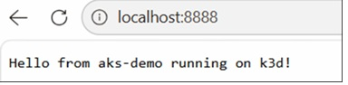
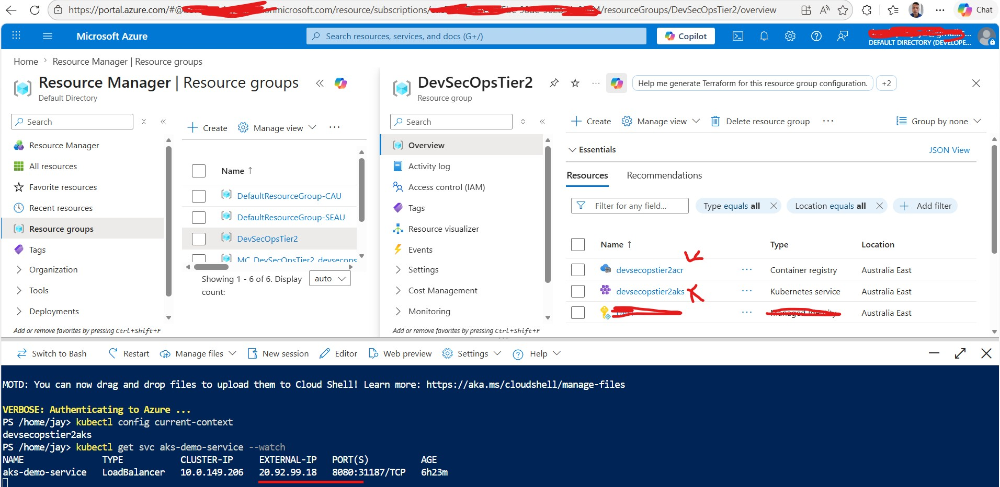
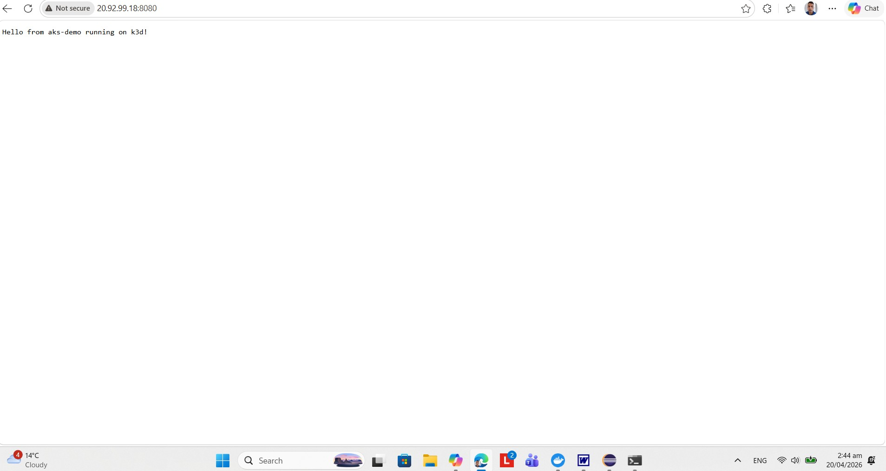

AIM: Towards Azure Kubernetes CI/CD setup.

14 April 2026 - Under Construction

# Version 0.1
19 April 2026 17:00 - Working locally on Docker desktop with:

## local dev
cd app
docker build -t aks-demo:v1 .
cd ..
k3d image import aks-demo:v1 -c aks-local
kubectl apply -f k8s/deployment.local.yaml
kubectl apply -f k8s/service.yaml
kubectl get pods
kubectl get svc
kubectl port-forward svc/aks-demo-service 8080:8080
[Navigate to] http://localhost:8080.

# Version 0.2
19 April 2026 19:37 - Pre-req is creating an Azure Container Registry (ACR) and an Azure Kubernetes Cluster (containing the ACR). First attempt at CICD AKS. 

# Version 0.3
19 April - Setup Helm on local machine Docker Desktop k38 and on Azure Kubernetes Cluster
## Local PC Kubernetes Cluster

## Azure Portal Kubernetes Cluster

--Working Evidence--

# NEXT STEPS
a. Move to https
b. BICES Automation of infrastructure