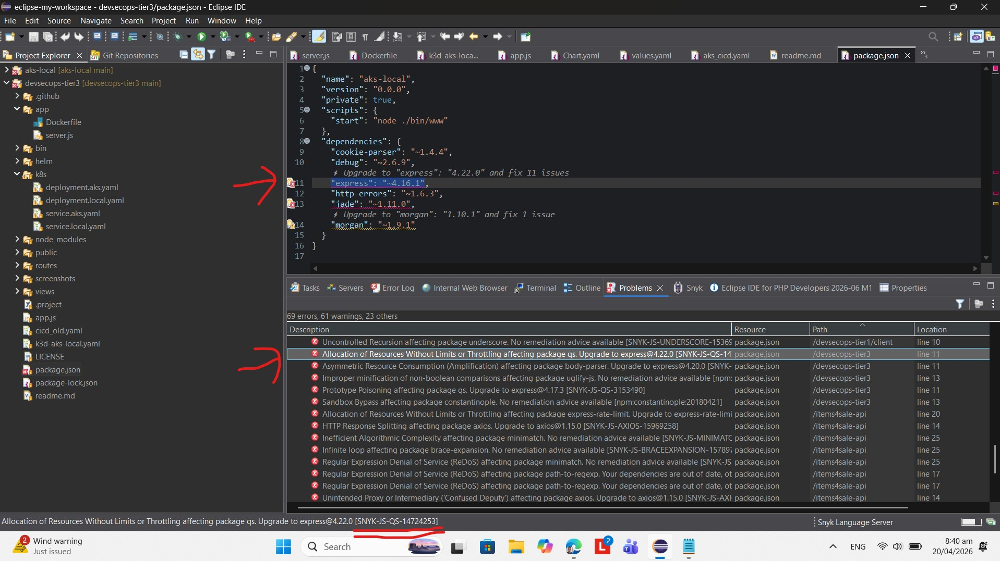

$${\color{red} © \space 2026 \space Jyotirmay \space Sarna. \space This \space work \space is \space original. \space Do \space not \space copy, \space repost, \space or \space use \space without \space permission. }$$

# AIM 
DEVSECOPS Demonstration to align with US Department of Defence (US DOD) definition (US DOD, 2023).
 
# SUMMARY
This project is part 3/3 of  DEVSECOPS demostration series. The first part is in BoundlessLove/DevSecOpsTier1 and covers CONTINUOUS INTEGRATION. The second part is in BoundlessLove/DevSecOpsTier2 and covers the local Kubernetes setup demonstration of CONTINOUS DEPLOYMENT. This is the third part - CONTINOUS DEPLOYMENT IN AZURE CLOUD. The core of this project demonstrates the CONTINUOUS DEPLOYMENT aspect of DEVSECOPS, via use of AZURE KUBERNETES AND HELM CHARTS. This Project Repository has two branches MAIN and DEV. The DEVSECOPS CONTINUOUS SECURITY part is implemented via ECLIPSE IBM PLUGIN "SYNC". The DEVSECOPS OPERATIONS part is currently manually setup via Azure CLI Commands, and the plan is to automated it using BICEP as per "Infrastructure as a Service (IAAS)" Paradigm. The next steps also plans to productionise this project via moving it to use HTTPS. Finally, for financial prudence, the Cloud Infrastructure for this project was manually deleted. Hence, in Next Steps, it is planned that the CONTINUOUS OPERATIONS part of DEVSECOPS will setup BICEB IAAS code that will create and tear down this infrastructure when the code is run.      

# TABLE OF CONTENTS
#### A. BACKGROUND
#### B. The CONTINUOUS INTEGRATION and TEST DRIVEN DEVELOPMENT Part of DEVSECOPS
#### C. The CONTINUOUS DEPLOYMENT Part of DEVSECOPS
#### D. The Security Part of DEVSECOPS
#### E. The Operations Part of DEVSECOPS
#### F. KNOWN ISSUE
#### G. NEXT STEPS
#### H. CONCLUSION
#### I. RELEASES
#### J. REFERENCES

# A. BACKGROUD
IDEAL DEVSECOPS contains five components:

a. CONTINUOUS INTEGRATION (CI)

b. CONTINUOUS DEPLOYMENT (CD)

c. CONTINUOUS SECURITY (CS)

d. CONTINOUS OPERATIONS (CO)

e. TEST DRIVEN DEVELOPMENT (TDD)

This DEVSECOPS series is an attempt to demonstrate it live.

# B. The CONTINUOUS INTEGRATION and TEST DRIVEN DEVELOPMENT Part of DEVSECOPS
See Releases section in README.MD of Repository BoundlessLove/DevSecOpsTier1 for details.

# C. The CONTINUOUS DEPLOYMENT Part of DEVSECOPS
It has been demonstrated using deployment to Kuberetes cluster. Repository BoundlessLove/DevSecOpsTier2 deploys to K38 cluster and BoundlessLove/DevSecOpsTier3 deploys to Azure Kubernetes using Helm Charts. See their Releases section in their README.MD for details (Section I in this document).

# D. The Security Part of DEVSECOPS
International Business Machines (IBM) has a plugin offering called SYNC in Eclipse, whose service can be availed freely by software engineers in Eclipse. It is a package download from Eclipse Marketplace. This software plugin in Eclipse scans through the code looking for vulnerable packages and such, and then lists them all with the exact issue as errors in the problems tab. The idea is for the user to be able to remediate it: 

API Endpoint for availing it is : 

- https://api.synk.io

# E. The Operations Part of DEVSECOPS

At the moment the Operations part of DEVSECOPs is being managed manually via one off AZURE CLI commands:

1.	Create Resource Group, if not already available
	az group create -n <RESOURCE_GROUP> -l <LOCATION>
	
2. Create Azure Container Registry
  az acr create \
	  -n <ACR_NAME> \
	  -g <RESOURCE_GROUP> \
    --sku Basic

3.  Create AKS and attach ACR
	az aks create \
	  -g <RESOURCE_GROUP> \
	  -n <AKS_NAME> \
	  --node-count 2 \
	  --attach-acr <ACR_NAME> \
	  --generate-ssh-keys

4. Ensure the variables above are in Github Secrets

# F. KNOWN ISSUE

In future this will be automated using BICEP. See Next Steps. In early hours of 20 April 2026, the above manual setup in Azure was deleted and any associated resources that Azure Kubernetes auto setup such as Kubernetes application Public IP address. Impact is that all future commits will fail the workflow - 'Build and Deploy to  AKS'.   

# G. NEXT STEPS

a. Move endpoints to https

b. BICES Automation of infrastructure

# H. CONCLUSION
The REPOSITORIES BoundlessLove/DevSecOpsTier1, BoundlessLove/DevSecOpsTier2 and BoundlessLove/DevSecOpsTier3 is an attempt to provide a birds eye view of how DEVSECOPS's five essential paradigms CI, CD, CS, CO and TDD all work, via practical demostration and screenshots, where possible.

# I. RELEASES

## Version 0.1
19 April 2026 17:00 - Working locally on Docker desktop with:

### local dev
cd app

docker build -t aks-demo:v1 .

cd ..

k3d image import aks-demo:v1 -c aks-local

kubectl apply -f k8s/deployment.local.yaml

kubectl apply -f k8s/service.yaml

kubectl get pods

kubectl get svc

kubectl port-forward svc/aks-demo-service 8080:8080

[Navigate to] http://localhost:8080.

## Version 0.2
19 April 2026 19:37 - Pre-req is creating an Azure Container Registry (ACR) and an Azure Kubernetes Cluster (containing the ACR). First attempt at CICD AKS. 

## Version 0.3
19 April - Setup Helm on local machine Docker Desktop k38 and on Azure Kubernetes Cluster
### Local PC Kubernetes Cluster

### Azure Portal Kubernetes Cluster

### Evidence of AKS Cluster Working

# J. REFERENCES

1. United States (US) Government's Department of Defence (DOD).(2023). DOCS Mission - Guidelines for partners to maintain complaince. Source: https://public.cyber.mil/devsecops/. Last Accessed: 20 April 2026

$${\color{red} © \space 2026 \space Jyotirmay \space Sarna. \space This \space work \space is \space original. \space Do \space not \space copy, \space repost, \space or \space use \space without \space permission. }$$

